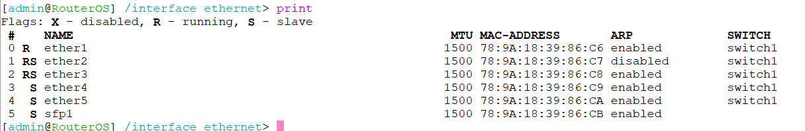
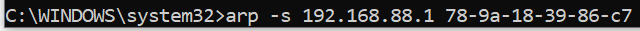
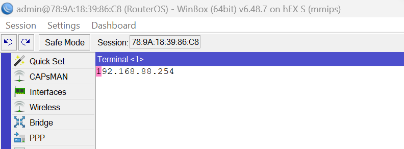
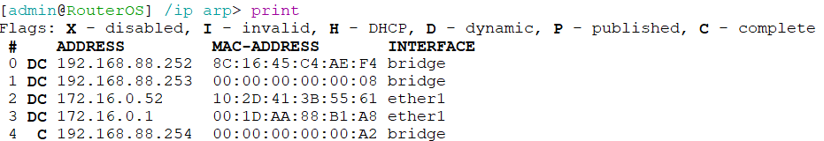

# 1. Prepare ARP
 

To create a static mapping, we first need to disable dynamic ARP, and therefore automatic resolution on the interface:

`> interface > ethernet > edit [INTERFACE] > arp > [MODIFY value to disabled]`

(we disable this on the ether2 connection to client)

 

In the client machine we create a static ARP entry, featuring the router's IP and interface MAC address:

`C:\> arp -s 192.168.88.1  79-9a-18-39-86-c7`

And in the router we create an entry for the reverse:

`add [ENTRY]`

`edit [ENTRY] addr (replace with desired IP address)`

`edit [ENTRY] mac (replace with client MAC address)`

Note the entry is not flagged with D (dynamic)

 
# 2. NAT setup
 

To setup the basic configuation for NAT we used 
	/ip firewall nat add chain=srcnat out-interface=ether1 action=masquerade.
	This changes the outgoing packets leaving the rounter on the ether1 interface.	
	To confirm that we have NAT available, we put /ip firewall nat print in the terminal to look for 
	the chain-srcnat and action=masquerade.
	By doing this we would be able to access the internet.	
	For a specific port and address we can go to IP -> Firewall -> NAT tab then you can add a NAT
	and you can decide what type of connection you want (tcp or udp), and also change the destination and 
	source IP and ports. 
	You can also change the chain to dstnat.

 
# 3. Load balancing
 
There are multiple methods that can be employed for load balancing we chose PCC (per-connection-classifier) as this can be configured on the one router. We don't have access to multiple WAN connections but the example shows how we would divide traffic based on src-address:

First, we ensure the correct IPs are set up for each incoming connection to the ISP (for example, two ethernet interfaces) and for the LAN.

Second, we begin to add firewall mangle rules, basically markers for packets that identify them for future processing: Our policy routing utilies the prerouting chain, we add two rules with our destination addresses and the accept action to force traffic into specified gateways.

Third, we create four rules with the mark-connection action, for the two ISP interfaces, then the LAN interface with the per-connection-classifier flag to divide the traffic based on the result of a division operation. This is to ensure we balance the load across both ISP interfaces and to ensure packets entering the network leave via the same gateway (and therefore public IP).

3
4

Fourth, we add four rules with the mark-routing action, two in the prerouting chain will apply the connection mark. And two in the output chain will apply a new routing mark to specify the outbound interface.

5

Fifth, the ip routes are modified to include a route for each routing mark.

7

Sixth, two more ip routes are created with heirarchical distances specified to enable failover in case of one connection dropping.

8

Finally, the firewall nat rules are modified to ensure the NAT is activated to select the correct IP for the specified outbound interface.

9

 
# 4. Static routing
 
We first had to set you a second WAN to be able to act as a way to set up the static routing. We then set up a firewall mangle to be able mark the packets, then we set up the routing mark for the packets.
We then set up the static route to direct the packets with the routing marks to go through the designated WAN gateway. We also needed to make sure that we had the masquerade rule under the NAT for the WAN interface to make sure it could handle the source NAT for outgoing packets.

